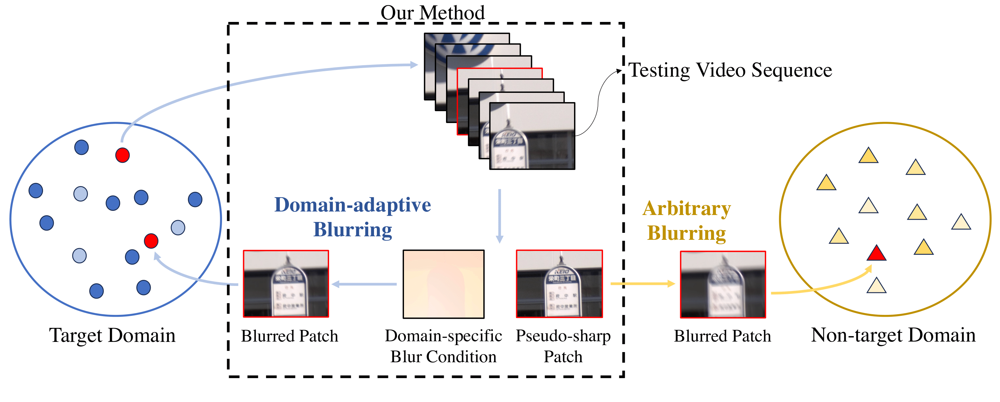
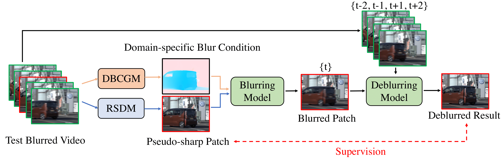
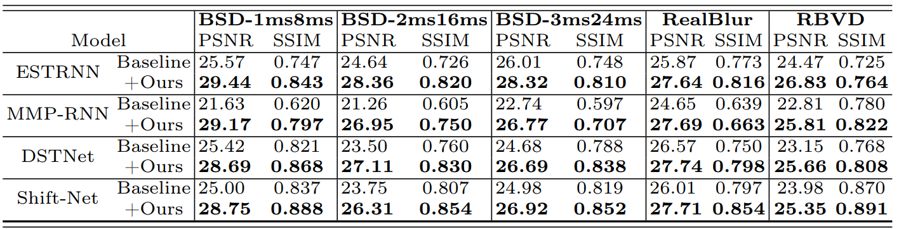

# Domain-adaptive-Video-Deblurring-via-Test-time-Reblurring(ECCV 2024)
Jin-Ting He, Fu-Jen Tsai, Jia-Hao Wu, Yan-Tsung Peng, Chung-Chi Tsai, Chia-Wen Lin, Yen-Yu Lin

[](https://arxiv.org/abs/2407.09059)
[](https://drive.google.com/file/d/19AjWRMlwz99D9QGQU3oKuFK8SPgIKv24/view?usp=sharing)

> Abstract : Dynamic scene video deblurring aims to remove undesirable blurry artifacts captured during the exposure process. Although previous video deblurring methods have achieved impressive results, they suffer from significant performance drops due to the domain gap between training and testing videos, especially for those captured in real-world scenarios. To address this issue, we propose a domain adaptation scheme based on a blurring model to achieve test-time fine-tuning for deblurring models in unseen domains. Since blurred and sharp pairs are unavailable for fine-tuning during inference, our scheme can generate domain-adaptive training pairs to calibrate a deblurring model for the target domain. First, a Relative Sharpness Detection Module is proposed to identify relatively sharp regions from the blurry input images and regard them as pseudo-sharp images. Next, we utilize a blurring model to produce blurred images based on the pseudo-sharp images extracted during testing. To synthesize blurred images in compliance with the target data distribution, we propose a Domain-adaptive Blur Condition Generation Module to create domain-specific blur conditions for the blurring model. Finally, the generated pseudo-sharp and blurred pairs are used to fine-tune a deblurring model for better performance. Extensive experimental results demonstrate that our approach can significantly improve state-of-the-art video deblurring methods, providing performance gains of up to 7.54dB on various real-world video deblurring datasets. 



## Pipeline


## Installation

## Preparation

### Training dataset
In our work, we train the ID-Blau, BME and Video Deblurring Model on [GoPro][https://seungjunnah.github.io/Datasets/gopro.html] dataset.

### Testing dataset
We test the following real-world dataset to validate our test-time adaptation method.
[BSD](https://drive.google.com/drive/folders/1LKLCE_RqPF5chqWgmh3pj7cg-t9KM2Hd)
[RBVD](https://drive.google.com/drive/folders/1YQUIGdW4SCAQW5-dxg2lwjTig2XKLeSG)
[RealBlur-j](https://github.com/rimchang/RealBlur?tab=readme-ov-file)

### Model weights
Before doing test-time adaptation for video deblurring model, you need to prepare the model weights for ID-Blau and BME. You can follow [ID-Blau](https://github.com/plusgood-steven/ID-Blau) and [BME](https://github.com/Jin-Ting-He/BME) to train your own model weight or download our pretrained weights. For each video deblurring model, you can download their pretrained weight(GoPro) from thier github repo.

### Dataset Structure
The dataset formats we use follow the BSD dataset format.

```bash
dataset/
├── video1/
│ ├── Blur/RGB/
├── video2/
│ ├── Blur/RGB/
├── video3/
│ ├── Blur/RGB/
```

## Implementation
The following section is our test-time adaptation method. We have divided our method into four parts for better maintenance and development.

### Step 1: Relative Sharpness Detection Module
In our work, we first detect the relatively sharp patches from testing video. Before running ```RSDM/main.py```, you need to modify lines 108 to 113 to include your data and model weights paths. If you want to know more, you can refer to our paper or [RSDM](https://github.com/Jin-Ting-He/RSDM).
```bash
python RSDM/main.py
```

### Step 2: Domain-adaptive Blur Condition Generation Module
This module aims to generate the domain-adaptive blur condition for testing video. Before running ```DBCGM/main.py```, you need to modify lines 237 to 248 to include your data and model weights paths.

```bash
python DBCGM/main.py
```

### Step 3: Generate domain-specific training data
This section utilize the [ID-Blau](https://github.com/plusgood-steven/ID-Blau) and our domain-adaptive blur condition to generate new training data for fine-tuning deblurring model. Before running ```BlurringModel/main.py```, you need to modify lines 161 to 164 to include your data and model weights paths.

```bash
python BlurringModel/main.py
```

### Step 4: Adapting and Testing the Deblurring Model
Now, you can use the result from our RSDM and the new training data from ID-Blau to fine-tune your video deblurring model. In this section, I take [ESTRNN](https://github.com/zzh-tech/ESTRNN) as a example. (If you want to utilize our method to adapt your own vide blurring model, you can refer our dataloader in ESTRNN.)

#### Adapting
Before adapting this model, you need to modify line 225 to 229 in ```deblur_finetune_DDP.py``` to include your data and model weights path.

```bash
CUDA_VISIBLE_DEVICES=0,1 torchrun --nproc_per_node=2 --master_port=29500 DeblurringModel/ESTRNN/deblur_finetune_DDP.py
```

#### Testing
Before testing the model adapted by our method, you need to modify line 149 to 154 in ```deblur_inference.py``` to include your data and model weights path.

```bash
python DeblurringModel/ESTRNN/deblur_inference.py
```

## Results
We compare the deblurring performance of four video deblurring methods using five video deblurring datasets. "Baseline" indicates that the deblurring model is trained on the GoPro dataset and tested on a specific dataset. "+Ours" indicates that the deblurring model is adapted using our method. This table demonstrates that our method can significantly improve the performance of existing video deblurring models on various real-world datasets.


## Citation
```
@inproceedings{He2024DADeblur,
  author    = {Jin-Ting He, Fu-Jen Tsai, Jia-Hao Wu, Yan-Tsung Peng, Chung-Chi Tsai, Chia-Wen Lin, Yen-Yu Lin},
  title     = {Domain-adaptive-Video-Deblurring-via-Test-time-Reblurring},
  booktitle = {ECCV},
  year      = {2024}
}
```